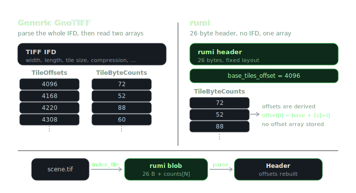

<p align="center">
  
</p>

<p align="center">
  <a href="https://pypi.org/project/rumi-eo/"></a>
  
  <a href="#license"></a>
</p>

<p align="center"><i>rumi is the Quechua word for stone.</i></p>

A GeoTIFF can be written in countless ways, and that flexibility is half of why they get painful to read at scale. Deep learning reads millions of chips per epoch, and with loose layouts a reader has to work out each file before it can touch the pixels.

rumi solves that by supporting only one layout. A rumi file is always **BigTIFF, tiled, band separate, and tile interleaved**. Every tile is a self-contained [OpenZL](https://github.com/facebook/openzl) frame. There are no overviews and nothing left to guess about. The full rules live in the [specification](SPEC.md).

Because the layout is fixed, almost everything about a rumi file is predictable. The metadata that is left fits in a tiny self-contained space, so a million files stay indexed in memory and reads go straight to the pixels.

<p align="center">
  
</p>

## Install

```bash
pip install rumi-eo
```

## Quick start

```python
import rumi
import openzl.ext as zl

# build any OpenZL compressor, here delta then zstd
c = zl.Compressor()
g = zl.graphs.Zstd()
g = zl.nodes.ConvertNumToSerialLE()(c, g)
g = zl.nodes.DeltaInt()(c, g)
c.select_starting_graph(g)

# tile the array, compress each chunk, assemble
chunks, layout = rumi.tile(arr, tile=512)
cctx = zl.CCtx()
cctx.ref_compressor(c)
cctx.set_parameter(zl.CParam.FormatVersion, rumi.OPENZL_VERSION)
frames = [cctx.compress([zl.Input(zl.Type.Numeric, ch)]) for ch in chunks]
rumi.write("scene.tif", frames, layout)

# read: index the file into a blob, parse it with no I/O, then read with an einops layout
blob = rumi.index_file("scene.tif")
header = rumi.parse(blob)
arr = rumi.read("scene.tif", header, "b y x")     # (B, Y, X)
```

## Write

Writing is three steps, and the compression in the middle is entirely yours. rumi tiles, you compress, rumi assembles.

```python
chunks, layout = rumi.tile(arr, tile=512)
```

`tile` cuts a `(B, Y, X)` array into chunks in tile order, samples innermost, padding edge tiles to the full tile size. It returns the chunks as `(N, T, T)` and a `layout` carrying the grid and dtype. The order is fixed, so a chunk never lands in the wrong place.

```python
cctx = zl.CCtx()
cctx.ref_compressor(c)
cctx.set_parameter(zl.CParam.FormatVersion, rumi.OPENZL_VERSION)
frames = [cctx.compress([zl.Input(zl.Type.Numeric, ch)]) for ch in chunks]
```

You compress each chunk with your own OpenZL compressor `c`. Because this runs per chunk, the graph can vary chunk by chunk, a light one for flat tiles and a heavier one for dense ones, all inside your loop. rumi never sees it.

```python
rumi.write("scene.tif", frames, layout)
```

`write` takes the compressed frames in tile order plus the `layout` and assembles the rumi file. The OpenZL decoder is universal, so a reader needs nothing about which graph you used.


## Codecs

On top of the OpenZL built-ins, rumi ships a few custom codecs you drop straight into your graph. They chain like any node and run inside the OpenZL frame, not the container. The lossless ones live under `rumi.experimental`, the near lossless ones under `rumi.lossy`.

| codec | namespace | what it does |
|---|---|---|
| `PlanarInt` | `rumi.experimental` | predicts each pixel from W plus N minus NW |
| `DeltaWInt` | `rumi.experimental` | horizontal delta |
| `DeltaNInt` | `rumi.experimental` | vertical delta |
| `quant_block` | `rumi.lossy` | near lossless, every pixel within `max_error` of the original |

The experimental predictors decorrelate a tile before the entropy stage and stay scannable on read.

```python
c = zl.Compressor()
g = zl.graphs.Entropy()
g = zl.nodes.Zigzag()(c, g)
g = rumi.experimental.PlanarInt(width=512)(c, g)
c.select_starting_graph(g)
```

A frame built with a lossy codec is no longer bit exact. It keeps the `rumi.lossy.` prefix as a warning, and only a reader that holds the codec, like rumi, reconstructs it.

## Index

```python
blob = rumi.index_file("scene.tif")
```

Run this once per file to get its blob. It reads the file, pulls the tile table, and returns the blob. Store it next to the path in your catalog, a Parquet column works well.

## Parse

```python
header = rumi.parse(blob)
header.shape, header.dtype
```

`parse` rebuilds the tile layout from the blob with no I/O and hands back a `Header`. `header.shape` and `header.dtype` give you the size and type.

## Read

```python
arr = rumi.read("scene.tif", header, "b y x", b=(0,3), y=(0,512), x=(0,512))  # (3,512,512)
arr = rumi.read("scene.tif", header, "y x b", b=[3,2,1])                      # HWC, bands reordered
arr = rumi.read("scene.tif", header, num_threads=4)                           # whole image, parallel decode
```

Returns a numpy array. The argument after `header` is the output layout, default `"b y x"`. Each axis you name can take a same-named argument.

- a tuple `(start, stop)` is a slice, the cheap case since it keeps tiles in disk order. `y` and `x` only take a slice or all.
- a list `[i, j, k]` picks those 0-based positions in that order. Fine for `b` (and `n` on a stack), more flexible but it can scatter the read.
- leaving an axis out reads all of it.

Prefer slices. rumi keeps all bands of a tile together, so a band slice reads them in order without stepping over the ones you skip. It is still one read per tile, so the win is locality and readahead, not a single seek.

`num_threads` sets decode parallelism. The pool is process global and sized on first use, so the first threaded read fixes the count for the whole process. Default is single threaded.

## Stack

```python
headers = [rumi.parse(b) for b in blobs]
arr = rumi.read(paths, headers, "n b y x", n=(0,12), b=(0,4))   # (12,4,Y,X)
arr = rumi.read(paths, headers, "(n b) y x", b=(0,4))           # fuse layers and bands into channels
arr = rumi.read(paths, headers, "n (y x) b", b=(0,4))           # tokens per layer
```

Pass lists of paths and headers and `read` adds an `n` axis over the assets. Reorder it, fuse it into channels with `(n b)`, or unfold space into tokens. The assets must match in size and encoding or it raises, no ragged cubes. This stacking is in memory at read time. For an N cube that lives on disk as one object, see the companion `rumikuna` format.

## Data model

<p align="center">
  
</p>

| level | shape | what it is |
|---|---|---|
| tile | T × T | one band at one grid position, one OpenZL frame |
| cell | B × T × T | every band at one position, contiguous on disk |
| Image | (B, Y, X) | one grid of cells, one rumi file |
| Cube | (N, B, Y, X) | N grid-aligned Images stacked |
| ImageCollection | set of Images | Images that do not share a grid |
| CubeCollection | set of Cubes | Cubes that do not share a grid |

One rumi file is one Image. An `ImageCollection` is just a set of rumi files, so it needs no format of its own. The `Cube` comes from the companion `rumikuna` format, and a `CubeCollection` is just a set of rumikunas.

The names come from stone. rumi is a single stone, one Image. rumikuna is the wall raised from them, the Cube.

## License

GPL-3.0

<div align="center">
  <br>
  Made with ♥ by
  <br><br>
  <a href="https://asterisk.coop">
    
  </a>
</div>