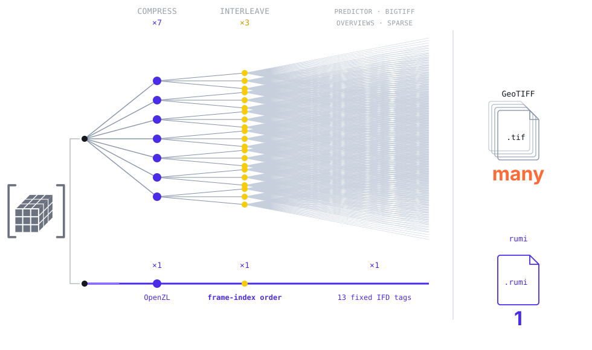

<p align="center">
  
</p>

<p align="center">
  <a href="https://pypi.org/project/rumi-eo/"></a>
  
  <a href="#license"></a>
</p>

<p align="center"><i>rumi is the Quechua word for stone.</i></p>

rumi is a GeoTIFF-inspired raster format for machine-learning datasets. It reads complete images or small windows directly into NumPy, PyTorch, JAX, and TensorFlow.

rumi stores each image as independently compressed [OpenZL](https://github.com/facebook/openzl) frames. A read decodes only the frames it needs.

rumi files use the `.rumi` extension. The exact binary layout is defined in the [format specification](SPEC.md).

<p align="center">
  
</p>

## Install

To read rumi files:

```bash
pip install rumi-eo
```

To write them as well, install the OpenZL writer dependency:

```bash
pip install "rumi-eo[write]"
```

Requires Python 3.11+. Wheels are available for Linux x86-64 and macOS arm64.

## Write and read an image

rumi expects arrays in `(bands, rows, columns)` order. Writing has three steps: split the array into frames, compress each frame with `geozl`, and write the file.

```python
import geozl
import numpy as np
import rumi

image = np.random.default_rng(0).integers(
    0, 4096, size=(4, 1024, 1024), dtype=np.uint16
)

# 1. Split the image into frames.
frames = rumi.frames(image, tile_size=512)

# 2. Compress every frame.
for frame in frames:
    graph = geozl.graph(frame.data, "planar>zigzag>zstd")
    frame.compressed = geozl.compress(frame.data, graph=graph)

# 3. Write the file. Keep the returned header for fast later reads.
path, header = rumi.write("scene.rumi", frames)

# Read the complete image as NumPy.
result = rumi.read(path, header)

# Read bands 0 and 3 from a 512 x 512 window.
chip = rumi.read(path, header, b=[0, 3], y=(0, 512), x=(0, 512))
```

The header is a small binary index. Store it next to the file path in Parquet or another catalog and pass both values to `rumi.read`. If you omit it, rumi can rebuild it from a local file:

```python
result = rumi.read("scene.rumi")
```

## PyTorch

Return a tensor by selecting the framework:

```python
tensor = rumi.read(path, header, framework="torch")
```

rumi uses one thread by default. Keep that default inside a `torch.utils.data.DataLoader`: its workers are already separate processes, so additional pools usually oversubscribe the CPU.

For an interactive full-image read in a single process, enable parallel decoding before the first parallel read:

```python
rumi.set_num_threads(8)
image = rumi.read(path, header)
```

The same setting is available as `RUMI_NUM_THREADS=8` or `RUMI_NUM_THREADS=ALL_CPUS`. Forked workers default to one rumi thread. If the environment sets a larger value, call `rumi.set_num_threads(1)` in `worker_init_fn` before the first read.

## Current limits

- rumi is beta software. Version 0.15 is its first compatibility baseline.
- A CRS must be an EPSG code, or be omitted.
- Sources are local paths or bytes already in memory; object-storage URLs are not read directly yet.

## Learn more

- [Format specification](SPEC.md)
- [Changelog](CHANGELOG.md)
- [Compatibility policy](COMPATIBILITY.md)
- [Security policy](SECURITY.md)
- [Ten-minute notebook](examples/rumi-demo.ipynb)
- [Issue tracker](https://github.com/asterisk-labs/rumi/issues)

## License

GPL-3.0

<div align="center">
  <br>
  Made with &#9829; by
  <br><br>
  <a href="https://asterisk.coop">
    
  </a>
</div>
