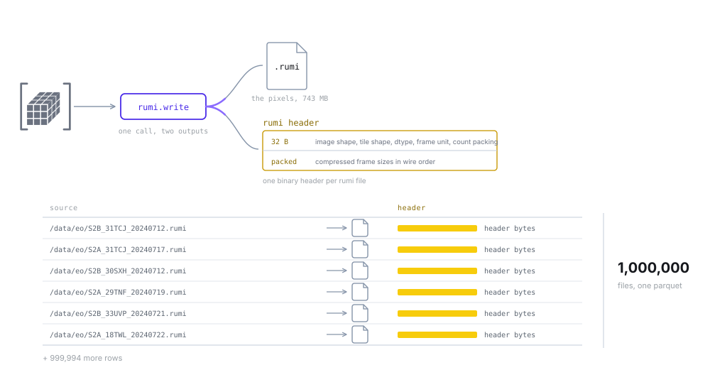

<p align="center">
  
</p>

<p align="center">
  <a href="https://pypi.org/project/rumi-eo/"></a>
  
  <a href="#license"></a>
</p>

<p align="center"><i>rumi is the Quechua word for stone.</i></p>

A GeoTIFF can be written in countless ways, and that flexibility is half of why they get painful to read at scale. Striped or tiled, bands interleaved or planar, which codec, which predictor, offsets of 4 bytes or 8, how many IFDs. Each one is a question the reader answers before it can read anything, once per file, a million times.

rumi answers them the same way every time. A rumi GeoTIFF file is ALWAYS a **BigTIFF, tiled, band separate, and tile interleaved**, one IFD, no overviews, and every tile is a self-contained [OpenZL](https://github.com/facebook/openzl) frame. The full rules live in the [specification](SPEC.md).

Because the layout is fixed, everything in front of the pixels is predictable. The same tags, in the same order, with every value in the same place, so the byte where the tile data starts follows from the shape of the image. Two scenes of the same shape put their first tile at the same offset, whatever is in them. What metadata is left over is small enough to keep a million files indexed in memory, and reads go straight to the pixels.

<p align="center">
  
</p>

<p align="center">
  <i>A GeoTIFF gives you thousands of valid ways to write the same array. rumi gives you just one way.</i>
</p>


## Status

> [!WARNING]
> **TIFF compression tag 60000 is experimental, not a registered code.**
> rumi marks OpenZL-compressed tiles with TIFF `Compression` tag `60000`. This is not a registered TIFF compression code, it is a private-range value rumi uses by convention. A standard TIFF or GeoTIFF reader cannot decode a rumi file, it sees an unknown compression. The value may change if OpenZL is assigned an official tag or if it collides with another private use. A rumi file is only readable by a reader that knows `60000` means OpenZL.

> [!NOTE]
> **The CRS is an EPSG code, or nothing.** rumi writes the CRS as one EPSG code and stops there. A CRS that only WKT or a PROJ string can name does not fit, and neither do ESRI codes, compound and vertical CRS, or the coordinate epoch of a dynamic CRS. Each of those is as long as its contents make it, so the header would grow with the CRS and stop being predictable. A raster that needs one of them wants an ordinary GeoTIFF.

## Install

```bash
pip install rumi-eo
```

## Quick start

```python
import numpy as np
import geozl
import rumi

arr = np.random.randint(0, 4096, (4, 2048, 2048), dtype=np.uint16)  # (B, Y, X)

# 1. Cut the Image into a TileFrame
tf = rumi.frames(arr, tile_size=512)

# 2. You build the geozl graph, run the graph on the tile, and compress the tile.
for t in tf:
    g = geozl.graph(t.data, "planar>zigzag>transpose>entropy")
    t.compressed = geozl.compress(t.data, graph=g)

# 3. Write the TileFrame to a rumi file, and cache the rumi header for later reads
path, header = rumi.write("scene.tif", tf)

# Hand back a numpy array
arr = rumi.read("scene.tif")                          # (B, Y, X)

# Window a read, and reuse the cached blob to skip re-reading the header
arr = rumi.read("scene.tif", header, b=[0, 3], y=(0, 512), x=(0, 512))
```

## Stateless reads

A rumi read is one call that takes a path and a header and hands back pixels. Nothing is opened beforehand, nothing is remembered afterwards.

Any other reader has to work differently. Before it can touch a pixel it opens the file, parses the IFD, and loads the offset arrays, and because repeating that per read would be absurd it keeps the result alive in memory. That memory is state. It belongs to one process, it dies with it, and it has to be rebuilt from scratch anywhere else. Sixteen dataloader workers means the same file opened and parsed sixteen times.

`rumi.write` hands you that state up front, as bytes.

<p align="center">
  
</p>

<p align="center">
  <i>One path plus one header is one row, so a collection of files is a table.</i>
</p>

With the header in hand there is nothing left to discover. The reader already knows where the tiles it wants begin and how long they are, so it reads exactly those bytes. No open, no parse, nothing cached per file, and nothing that workers have to share.

**It is small enough to keep a million of them**. rumi keeps 27 bytes and one number a tile.

**And because the header is bytes, it is a column.** A path in one column, the header in the other. That pair is the whole read, so a million scenes is a million rows and nothing else.

```python
import pandas as pd

rows = []
for scene, tf in scenes:
    path, header = rumi.write(scene, tf)
    rows.append({"path": str(path), "rumi_header": header})

pd.DataFrame(rows).to_parquet("catalog.parquet")
```

A read then takes a row and goes straight to the pixels.

```python
catalog = pd.read_parquet("catalog.parquet")
row = catalog.iloc[0]

chip = rumi.read(row["path"], row["rumi_header"], y=(0, 512), x=(0, 512))
```

The collection stops being a pile of files and becomes one object you can query, where reaching any tile in it costs a single seek. Nothing in the catalog is a live connection, so it travels, and a worker that receives one row can read without ever having seen the dataset.

> [!NOTE]
> rumi speaks no network protocol yet. A source is a local path, or a buffer you already hold, so a remote scene means fetching its bytes yourself for now. Reading object storage paths directly is on the way.

## Data model

<p align="center">
  
</p>

| level | shape | what it is |
|---|---|---|
| tile | T x T | one band at one grid position, one OpenZL frame |
| cell | B x T x T | every band at one position, contiguous on disk |
| Image | (B, Y, X) | one grid of cells, one rumi file |
| Cube | (N, B, Y, X) | N grid-aligned Images stacked |
| ImageCollection | set of Images | Images that do not share a grid |
| CubeCollection | set of Cubes | Cubes that do not share a grid |

One rumi file is one Image. An `ImageCollection` is just a set of rumi files, so it needs no format of its own. The `Cube` comes from the companion `zumi` format, and a `CubeCollection` is just a set of zumis.

The names come from stone. rumi is a single stone, one Image. zumi is the wall raised from them, the Cube.

## License

GPL-3.0

<div align="center">
  <br>
  Made with &#9829; by
  <br><br>
  <a href="https://asterisk.coop">
    
  </a>
</div>
