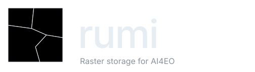

<p align="center">
  
</p>

<p align="center">
  <a href="https://github.com/asterisk-labs/rumi/actions/workflows/ci.yml"></a>
  <a href="https://pypi.org/project/rumi-eo/"></a>
  
  <a href="#license"></a>
</p>

<p align="center"><i>rumi is the Quechua word for stone.</i></p>

Rumi is stateless raster storage for AI4EO. It cuts an Image or a Cube into independently
compressed frames and keeps their index in a tiny external header, so every read fetches
only the frames it needs.

## Features

- **The GDAL raster model, extended with time**, so one file carries an Image `(B, Y, X)`
  or a Cube `(T, B, Y, X)` along with its affine transform, CRS, band descriptions and
  dates.
- **The tile `(H, W)` is the smallest unit**, and bands and dates are ordered around it,
  either one per frame or all together in one frame.
- **Patterns in einops notation**, such as `b (row h) (col w) -> row col (b h w)` to store
  every band of a tile together, or `y x b` to read channels last.
- **GeoZL is the only supported codec**, lossless or lossy, and each frame can use a
  different compression graph.
- **Minibatches in one call**, with `read_many` fetching windows from many files
  concurrently, ideal for training data loaders.
- **Multithreaded decoding** that overlaps with downloads, set with
  `rumi.set_num_threads`.
- **Zero-copy arrays** for NumPy, PyTorch, JAX and TensorFlow, shared through DLPack,
  with 21 dtypes including bfloat16, float8 and complex.
- **Reads from anywhere** through [Karu](https://github.com/asterisk-labs/karu), whether
  the file sits on a local disk, behind HTTP, in S3, GCS, Azure, Hugging Face or Source
  Cooperative, or inside another file with `/vsisubfile/`.
- **A predictable header**, so `rumi.frame_start` knows where the frames begin before
  anything is compressed.
- **A C API** in `rumi.h`, so other languages can bind the same core.

## Quick start

```python
import geozl
import numpy as np
import rumi

image = np.random.default_rng(0).integers(0, 4096, (4, 1024, 1024), dtype=np.uint16)
frames = rumi.frames(image, "b (row h) (col w) -> row col (b h w)", tile_size=512)
for frame in frames:
    graph = geozl.graph(frame.data, "planar>zigzag>zstd")
    frame.compressed = geozl.compress(frame.data, graph=graph)

path, header = rumi.write("scene.rumi", frames, bands=["B2", "B3", "B4", "B8"],
                          time=["2024-08-25"])
chip = rumi.read(path, header, bands=[2, 3], window=(0, 0, 256, 256))
```

## Installation

```bash
pip install rumi-eo
```

Wheels are available for Linux x86-64 and macOS arm64 on Python 3.11 or newer. Rumi is
not stable yet, and the format may still change before 1.0.

## Documentation

[Guide](https://asterisk.coop/rumi/) · [Specification](SPEC.md) ·
[Compatibility](COMPATIBILITY.md) · [Changelog](CHANGELOG.md) · [Security](SECURITY.md)

Coding agents can install the Rumi skill with `npx skills add asterisk-labs/rumi`.

## License

GPL-3.0. See [`LICENSE`](LICENSE).

<div align="center">
  <br>
  Made with ♥ by
  <br><br>
  <a href="https://asterisk.coop">
    
  </a>
</div>
