# rumi

- Specification 0.1.0
- Status Draft
- Date 2026-08-15
- License GPLv3

rumi is a raster file format with a predictable, GeoTIFF-inspired layout and a compact external **binary header**. The restricted file profile makes it possible for the header to contain everything needed to locate any frame directly, without first opening or parsing the rumi file. This makes access stateless, even across millions of files. See the [File profile](#file-profile) section for the full set of restrictions.

The filename extension for the format is `.rumi`.


The words MUST, MUST NOT, SHOULD, and MAY in this document carry the RFC 2119 meaning.

## Scope

This document defines the rumi file profile, the exact contents of the single IFD, and the binary layout of the rumi header blob. The blob lets a reader locate every compressed frame.

## Data model

rumi implements the lower levels of the AI4EO Data Model, which organizes raster data as a hierarchy of grid-aligned tensors for training.



| level           | shape         | definition                          |
| --------------- | ------------- | ----------------------------------- |
| tile            | T × T         | one band at one grid position       |
| cell            | B × T × T     | all bands at one grid position      |
| Image           | (B, Y, X)     | one grid of cells and one rumi file |
| Cube            | (N, B, Y, X)  | N grid-aligned Images stacked       |
| ImageCollection | set of Images | Images that do not share a grid     |
| CubeCollection  | set of Cubes  | Cubes that do not share a grid      |

Grid-aligned Images stack directly into a 4D tensor called a Cube. Images that do not share a grid remain an ImageCollection.

## Frames

A frame is the unit of compression. Each frame is one self-contained OpenZL frame, and a rumi file is a run of them.

All frames in a rumi file MUST use the same pinned OpenZL frame format version.

Everything required to decode a frame MUST be contained in the frame itself. rumi stores no codec or modelling metadata outside it.

`frame_unit` defines what one frame contains.

| frame_unit | one frame holds                | decodes to  | N                               |
| ---------- | ------------------------------ | ----------- | ------------------------------- |
| `0` tile   | one band at one grid position  | `(h, w)`    | `tiles_across * tiles_down * B` |
| `1` cell   | all bands at one grid position | `(B, h, w)` | `tiles_across * tiles_down`     |

`B` is `samples_per_pixel`. `h` and `w` are the actual frame height and width at that grid position, cut to the image bounds.

A tile frame lets a reader decode one band independently. A cell frame decodes all bands together, which lets OpenZL model correlation across bands.

Both modes use the same file structure. `frame_unit` changes what each frame contains, and therefore `N`.

### Frame index

Frames are stored in frame-index order, which is also their physical order in the file. Grid positions are traversed in row-major order.

```text
tiles_across = ceil(image_width / tile_width)
tiles_down   = ceil(image_length / tile_length)
```

For tile frames, all bands at one grid position come before the next position.

```text
frame_index(row, col, band) = (row * tiles_across + col) * B + band
N                           = tiles_across * tiles_down * B
```

For cell frames, there is one frame per grid position.

```text
frame_index(row, col) = row * tiles_across + col
N                     = tiles_across * tiles_down
```

### Deriving the frame unit

The blob carries `frame_unit` directly. A reader holding only the IFD derives it from the entry count of `TileOffsets`.

```text
g = tiles_across * tiles_down

count == g       ->  cell
count == g * B   ->  tile
```

A reader MUST reject a file whose count matches neither value. When `B` is `1` the two are equal and the two layouts are identical, so either reading is correct.

The frame unit is not stored in the IFD. No TIFF tag can carry it, since the interleaving a tag would describe belongs to the OpenZL frame and rumi does not define it. The entry count is the only place the choice is visible, and it is also the value a reader needs anyway.

### Rejected orders

For tile frames, a multi-band image can be laid out in two ways.

| ordering         | physical layout                                        | rumi     |
| ---------------- | ------------------------------------------------------ | -------- |
| band-interleaved | all tiles of band 0, then all tiles of band 1          | rejected |
| tile-interleaved | all bands at one grid position, then the next position | required |

The index of a `TileOffsets` entry is a position in a list. TIFF does not define how that position maps to a grid position and a band, so rumi defines the physical order explicitly.

The header blob stores byte counts in frame-index order and reconstructs offsets with a prefix sum. This works only when frame-index order is also the physical order of the frames in the file. Band-interleaved layout breaks that property and MUST be rejected.

For a single-band image, both layouts are identical.

## Sample encodings

`sample_format` gives the sample type and `bits_per_sample` gives its width in bits. For complex formats, `bits_per_sample` is the combined width of the real and imaginary components.

| sample_format | meaning                      |
| ------------- | ---------------------------- |
| `1`           | unsigned integer             |
| `2`           | signed integer               |
| `3`           | IEEE floating point          |
| `5`           | complex signed integer       |
| `6`           | complex IEEE floating point  |
| `100`..`106`  | rumi-private ML and EO types |

Valid values of `bits_per_sample` are `1`, `2`, `4`, `6`, `8`, `16`, `32`, `64`, and `128`.

The valid pairs are

| sample_format | bits_per_sample | encoding                                       |
| ------------- | --------------- | ---------------------------------------------- |
| 1             | 1               | 1-bit binary                                   |
| 1             | 2               | unsigned 2-bit integer                         |
| 1             | 4               | unsigned 4-bit integer                         |
| 1             | 8               | unsigned 8-bit integer                         |
| 1             | 16              | unsigned 16-bit integer                        |
| 1             | 32              | unsigned 32-bit integer                        |
| 1             | 64              | unsigned 64-bit integer                        |
| 2             | 2               | signed 2-bit integer                           |
| 2             | 4               | signed 4-bit integer                           |
| 2             | 8               | signed 8-bit integer                           |
| 2             | 16              | signed 16-bit integer                          |
| 2             | 32              | signed 32-bit integer                          |
| 2             | 64              | signed 64-bit integer                          |
| 3             | 16              | IEEE 16-bit floating point                     |
| 3             | 32              | IEEE 32-bit floating point                     |
| 3             | 64              | IEEE 64-bit floating point                     |
| 5             | 32              | complex signed integer, 16-bit components      |
| 5             | 64              | complex signed integer, 32-bit components      |
| 6             | 32              | complex IEEE floating point, 16-bit components |
| 6             | 64              | complex IEEE floating point, 32-bit components |
| 6             | 128             | complex IEEE floating point, 64-bit components |
| 100           | 8               | float8 E4M3FN                                  |
| 101           | 8               | float8 E5M2                                    |
| 102           | 16              | bfloat16                                       |
| 103           | 8               | float8 E8M0                                    |
| 104           | 6               | float6 E2M3                                    |
| 105           | 6               | float6 E3M2                                    |
| 106           | 4               | float4 E2M1                                    |

A reader MUST reject any pair not listed above.

All bands in a file MUST use the same pair. A tile frame contains `h * w` samples and a cell frame contains `B * h * w` samples.

## File profile

A file is rumi compliant when all of the following hold.

- the file is BigTIFF
- the file uses little-endian byte order, so the TIFF header begins with `II`
- the file has exactly one IFD
- the file has no overviews
- the file has no masks or auxiliary IFDs
- the image is tiled, not stripped
- at the tile level, tiles are stored tile-interleaved
- the single IFD is positioned before the frame data
- the IFD holds exactly the tags listed in Fixed IFD, and no others
- out-of-line tag values are placed as defined in Fixed IFD, with no gap before the frame data
- georeferencing is encoded as defined in Georeferencing
- the `(sample_format, bits_per_sample)` pair is one listed in Sample encodings
- each frame is one self-contained OpenZL frame, every frame in the file written at one pinned OpenZL frame format version
- `TileOffsets` and `TileByteCounts` are present, with `N` entries, and the entry count matches one of the two values in Deriving the frame unit
- no frame is sparse. Every frame is present and every `TileByteCounts` entry is greater than zero
- the frames form one contiguous run in frame-index order, each frame immediately followed by the next, with no framing between them

## Fixed IFD

A rumi IFD contains exactly the tags below, in rising tag order. A writer MUST NOT add any other tag.

Readers that parse the IFD to rebuild a header blob or validate a file MUST reject any file containing additional tags.

`B` is `samples_per_pixel` and `N` is the frame count.

| tag   | name                   | type   | count |
| ----- | ---------------------- | ------ | ----- |
| 256   | ImageWidth             | LONG   | 1     |
| 257   | ImageLength            | LONG   | 1     |
| 258   | BitsPerSample          | SHORT  | B     |
| 277   | SamplesPerPixel        | SHORT  | 1     |
| 322   | TileWidth              | SHORT  | 1     |
| 323   | TileLength             | SHORT  | 1     |
| 324   | TileOffsets            | LONG8  | N     |
| 325   | TileByteCounts         | LONG   | N     |
| 339   | SampleFormat           | SHORT  | B     |
| 34264 | ModelTransformationTag | DOUBLE | 16    |
| 34735 | GeoKeyDirectoryTag     | SHORT  | 16    |

Every rumi file carries all 11 tags. Files without georeferencing still carry `ModelTransformationTag` and `GeoKeyDirectoryTag` with the values defined in Undefined georeferencing.

### Placement

The IFD starts at byte `16`, immediately after the BigTIFF header. It is always `8 + 20 * 11 + 8` bytes long, which is `236` bytes. This includes the entry count, the 11 entries, and the zero offset for the next IFD.

Values of 8 bytes or less are stored directly inside their IFD entry. Larger values MUST be stored immediately after the IFD, in rising tag order and with no gaps between them.

The frame data starts immediately after the last external value. A writer MUST NOT add padding, alignment, reserved space, or any other bytes before it.

### Deriving base_frame_offset

The start of the frame data can be derived from the image shape and `frame_unit`. The IFD size is fixed, so only values larger than 8 bytes contribute to the external area.

```text
external = (2 * B  if B >= 5 else 0)      # 258 BitsPerSample
         + (8 * N  if N >= 2 else 0)      # 324 TileOffsets
         + (4 * N  if N >= 3 else 0)      # 325 TileByteCounts
         + (2 * B  if B >= 5 else 0)      # 339 SampleFormat
         + 128                            # 34264 ModelTransformationTag
         + 32                             # 34735 GeoKeyDirectoryTag

base_frame_offset = 16 + 236 + external
                  = 252 + external
```

The result MUST match the first entry of `TileOffsets`. Files with the same image shape, band count, and `frame_unit` start their frame data at the same byte.

## Georeferencing

Every rumi file carries exactly two georeferencing tags, `ModelTransformationTag` and `GeoKeyDirectoryTag`. No other GeoTIFF georeferencing tag may appear. `ModelPixelScaleTag` (33550), `ModelTiepointTag` (33922), `GeoDoubleParamsTag` (34736), and `GeoAsciiParamsTag` (34737) MUST NOT appear.

Both tags are always present. Files without georeferencing use the values defined in *Undefined georeferencing*. Georeferencing changes their contents, never their size.

### ModelTransformationTag

`ModelTransformationTag` always stores the full 4 × 4 transformation matrix as 16 doubles in row-major order. North-up rasters use the same representation with the rotation terms set to zero.

Using the full matrix keeps the georeferencing block the same size for every rumi file, regardless of rotation.

Given affine coefficients `(x_res, row_rot, x_origin, col_rot, y_res, y_origin)`, the matrix is

```text
x_res    row_rot  0  x_origin
col_rot  y_res    0  y_origin
0        0        0  0
0        0        0  1
```

The third row is zero. GeoTIFF sets the Z scale to `0` by default, since the model space of a raster is flat.

### GeoKeyDirectoryTag

rumi represents a CRS only by its EPSG code. The directory is always 16 shorts, consisting of a four-short header followed by three four-short keys. Its size is therefore always 32 bytes.

| key                                           | id           | value                               |
| --------------------------------------------- | ------------ | ----------------------------------- |
| GTModelTypeGeoKey                             | 1024         | `1` projected or `2` geographic     |
| GTRasterTypeGeoKey                            | 1025         | `1` PixelIsArea or `2` PixelIsPoint |
| GeographicTypeGeoKey or ProjectedCSTypeGeoKey | 2048 or 3072 | EPSG code                           |

A geographic CRS uses key `2048` and a projected CRS uses key `3072`. This MUST agree with `GTModelTypeGeoKey`. The EPSG code MUST be defined by the EPSG registry and MUST fall between `1024` and `32766`.

### Undefined georeferencing

Some rasters have no georeferencing, such as training chips, synthetic tensors, or derived masks. A rumi file still writes both georeferencing tags so their size and placement never change.

`ModelTransformationTag` uses the following matrix.

```text
1  0  0  0
0  1  0  0
0  0  0  0
0  0  0  1
```

`GeoKeyDirectoryTag` keeps the same three keys and the same 32-byte size. `GTModelTypeGeoKey` and `GeographicTypeGeoKey` are both `0`. `GTRasterTypeGeoKey` still records whether pixels represent areas or points.

| key                  | id   | value      |
| -------------------- | ---- | ---------- |
| GTModelTypeGeoKey    | 1024 | `0`        |
| GTRasterTypeGeoKey   | 1025 | `1` or `2` |
| GeographicTypeGeoKey | 2048 | `0`        |

A reader MUST interpret `GTModelTypeGeoKey` equal to `0` as no CRS and MUST NOT interpret the transformation matrix as valid georeferencing.

The two tags always occupy 160 bytes. Their values indicate whether georeferencing exists while their size and placement remain fixed.

rumi accepts only EPSG codes. WKT, PROJ strings, ESRI codes, user-defined CRS values, engineering CRS, compound CRS, vertical CRS, and coordinate epochs are not supported because they require variable-length metadata. A raster that needs them should use an ordinary GeoTIFF.

### Which codes are geographic

The numeric value of an EPSG code does not reveal whether the CRS is geographic or projected. A writer MUST determine the CRS type from the EPSG registry or a PROJ database and MUST NOT infer it from the code itself. A reader obtains the type directly from `GTModelTypeGeoKey`.

## Header blob

The header blob is a compact binary record stored outside the rumi file. It contains everything needed to locate any frame without first opening or parsing the file.

The blob consists of a fixed 28-byte header followed by the byte count of every frame, packed at the minimum required bit width.

```text
+---------------+----------------------------------+
| Header        | frame_byte_counts[N]             |
+---------------+----------------------------------+
  28 bytes        ceil(N * count_bits / 8) bytes
```

`N` is derived from the image shape and `frame_unit` as defined in [Frame index](#frame-index).

The blob size MUST be exactly `28 + ceil(N * count_bits / 8)` bytes and MUST contain no padding.

The blob stores no offsets. They are reconstructed as defined in [Deriving base_frame_offset](#deriving-base_frame_offset) and [Offset reconstruction](#offset-reconstruction).

### Header fields

| offset | size | type   | name              |
| ------ | ---- | ------ | ----------------- |
| 0      | 4    | uint32 | magic             |
| 4      | 2    | uint16 | version           |
| 6      | 4    | uint32 | image_width       |
| 10     | 4    | uint32 | image_length      |
| 14     | 2    | uint16 | tile_width        |
| 16     | 2    | uint16 | tile_length       |
| 18     | 2    | uint16 | samples_per_pixel |
| 20     | 1    | uint8  | bits_per_sample   |
| 21     | 1    | uint8  | sample_format     |
| 22     | 1    | uint8  | frame_unit        |
| 23     | 4    | uint32 | count_min         |
| 27     | 1    | uint8  | count_bits        |

#### magic

The magic value is `0x45564F4C`, represented on the wire as `4C 4F 56 45`. A reader MUST reject any other value.

#### version

The current binary format version is `1`. A reader that implements version `1` MUST reject any other value.

#### image_width and image_length

The raster dimensions in pixels. These match `ImageWidth` and `ImageLength` in the IFD.

#### tile_width and tile_length

The nominal tile dimensions in pixels. These match `TileWidth` and `TileLength` in the IFD.

Each value MUST be between `1` and `65535`, the range of its `uint16` field. No alignment or multiple-of-16 restriction applies. Tiles need not be square. A tile dimension MAY exceed the corresponding image dimension, in which case the grid holds a single position.

The grid size follows from these and the image dimensions, as defined in [Frame index](#frame-index).

Edge tiles are cut to the image bounds and are never padded. A reader MUST derive their actual dimensions from the image shape and the grid position, and MUST NOT trust a decoded length.

#### samples_per_pixel

The band count `B`. This matches `SamplesPerPixel` in the IFD and MUST be at least `1`.

#### bits_per_sample and sample_format

The sample type and its width, as defined in [Sample encodings](#sample-encodings). A reader MUST reject any pair not listed there.

#### frame_unit

What one frame contains. `0` means tile and `1` means cell, as defined in [Frames](#frames). A reader MUST reject any other value.

Together with the image shape, `frame_unit` determines `N`.

#### count_min and count_bits

`count_min` and `count_bits` define the frame byte count encoding, as defined in [Frame byte counts](#frame-byte-counts).

`count_min` is the smallest frame byte count. `count_bits` is the number of bits used to encode each residual and MUST be between `0` and `32`.

### Frame byte counts

After the 28-byte header, the blob stores the `N` compressed sizes of the frames in frame-index order. Every count MUST be greater than zero.

Rather than storing every count as a `uint32`, rumi stores the smallest count once and encodes each count as its difference from that minimum. The residuals are packed using the minimum bit width required to represent the largest one.

The original counts are reconstructed exactly.

#### Encoding

Let `c[i]` be the byte count of frame `i`.

```text
count_min  = min(c)
count_bits = 0 if max(c) == count_min else bit_length(max(c) - count_min)
```

`bit_length(x)` is the minimum number of bits required to represent `x`.

A writer MUST use exactly these values. `count_min` MUST be the smallest count and `count_bits` MUST be the minimum width required to represent the largest residual. This makes the encoding canonical, so two writers given the same counts produce the same bytes.

When all counts are equal, `count_bits` is `0` and no packed data follows the header. Every count is then `count_min`. A file with a single frame always has `count_bits` equal to `0`.

#### Packing

Residual `i` is

```text
residual[i] = c[i] - count_min
```

Residuals are packed consecutively using `count_bits` bits each, starting from the least significant bit of the first byte. They have no padding or alignment between them.

The packed region is exactly `ceil(N * count_bits / 8)` bytes. Unused bits in the final byte MUST be zero.

#### Decoding

```text
lo          = i * count_bits
residual[i] = the count_bits bits starting at lo, read little endian
c[i]        = count_min + residual[i]
```

Every residual ends inside the packed region, so a reader stays inside the blob it was given. Each frame byte count can be decoded independently.

When `count_bits` is `0`, every count is `count_min`.

### Offset reconstruction

rumi stores no frame offsets. A reader derives `base_frame_offset` and reconstructs every offset from the frame byte counts in frame-index order.

```text
offset[0]     = base_frame_offset
offset[idx+1] = offset[idx] + frame_byte_counts[idx]
```

A file is compliant only when the reconstructed offsets match `TileOffsets` in the same order.

Offsets MUST be compared in frame-index order and MUST NOT be sorted first. Sorting hides a band-interleaved layout, which also looks contiguous once sorted but places its frames in the wrong order.

A reader takes exactly `frame_byte_counts[idx]` bytes from `offset[idx]` and passes them to the OpenZL decoder. The next frame begins immediately after those bytes.

The offset of frame `k` can also be expressed as

```text
offset[k] = base_frame_offset
          + k * count_min
          + sum(residual[0:k])
```

The second term is a product and the third has no dependency between its terms, so reaching frame `k` does not require walking every frame before it.

## Why rumi is not a GeoTIFF

rumi uses the BigTIFF and GeoTIFF structures, but it is not a standard GeoTIFF. The following rules make it incompatible.

- **Required TIFF tags are absent.** rumi omits `Compression` and `PhotometricInterpretation`. TIFF treats a missing `Compression` as uncompressed, so a TIFF reader would read OpenZL frames as raw samples.
- **`PlanarConfiguration` is absent.** TIFF treats the missing tag as `1`, which sets the tile count to `tiles_across * tiles_down`. A tile-unit rumi file has `B` times that many, so a TIFF reader finds an entry count it does not expect. rumi omits the tag because its interleaving meaning describes the inside of a frame, which belongs to OpenZL.
- **Edge tiles are cut rather than padded.** TIFF pads tiles on the right and bottom edges to the full tile dimensions. rumi stores only the pixels inside the image bounds.
- **`SampleFormat` values `100` through `106` are rumi-specific.** They represent float8, bfloat16, float6, and float4 types that TIFF does not define.

## Changelog

- 0.1.0. Initial draft.
